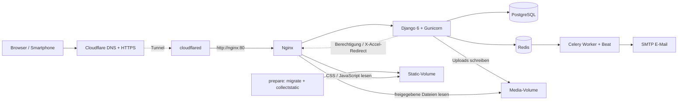
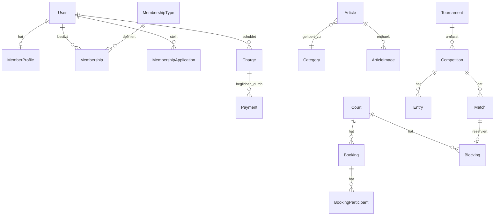

# Bauplan: Tennisverein-CMS auf Django-Basis

---

## 0. Zusammenfassung

Eine Web-Anwendung für einen Tennisverein mit vier Kernmodulen:


| Modul            | Zweck                                                                                              |
| ---------------- | -------------------------------------------------------------------------------------------------- |
| **News**         | Artikel mit Bildern veröffentlichen, öffentlich lesbar                                             |
| **Mitglieder**   | Selbstregistrierung, Freischaltung, Mitgliedschaften und Beiträge (jährlich/monatlich), Gastkonten |
| **Platzbuchung** | Plätze verwalten, Buchungen durch Mitglieder und Gäste, Gastgebühren                               |
| **Turniere**     | Turniere/Ortsmeisterschaften mit Anmeldung, Auslosung, Ergebnissen                                 |


**Tech-Stack (verbindlich):** Python 3.12+, **Django 6.0 (`Django>=6.0,<6.1`)**, PostgreSQL 16, Django-Templates + HTMX + CSS, Gunicorn hinter **Nginx**, Celery + Redis (E-Mails, Erinnerungen), Docker Compose, Cloudflare Tunnel, pytest. Aktuell liegt fertiges CSS unter `static/css/styles.css`; ein Tailwind-Build ist erst bei einer späteren Einführung erforderlich.

**Deployment-Entscheidung (Stand 02.10.2026):** Statische Dateien und freigegebene Medien werden durch Nginx ausgeliefert. Der zuvor diskutierte WhiteNoise-Ansatz wird nicht eingesetzt; es gibt keine WhiteNoise-Abhängigkeit oder -Middleware. Schritt-für-Schritt-Anleitung: [DEPLOYMENT.md](DEPLOYMENT.md). Prüfstand und verbleibende Betriebsprüfungen: [DEPLOYMENT_PRUEFUNG.md](DEPLOYMENT_PRUEFUNG.md).

> **Versionsstrategie Django:** Start auf Django 6.0. Das Upgrade auf **Django 6.2 LTS** (erwartet April 2027, Support bis ca. 2030) ist fest eingeplant (siehe AP-11). Django 5.2 LTS ist die Rückfalloption, falls ein benötigtes Paket Django 6 nicht unterstützt. Versionen immer exakt in `pyproject.toml` pinnen und ein Lockfile verwenden (`uv.lock` oder `requirements.lock`).

---

## 1. Verbesserte Anforderungen

Die ursprünglichen Anforderungen wurden präzisiert, um Lücken zu schließen, die bei der Umsetzung sonst zu Rückfragen oder Fehlannahmen führen würden.

### 1.1 Rollen und Berechtigungen


| Rolle                        | Beschreibung                                                                                                                                             |
| ---------------------------- | -------------------------------------------------------------------------------------------------------------------------------------------------------- |
| **Besucher**                 | Nicht angemeldet. Liest News, sieht Turnierergebnisse und Platzbelegung (anonymisiert).                                                                  |
| **Gast**                     | Registriert und per E-Mail bestätigt, **keine** Freischaltung durch den Verein nötig. Kann kostenpflichtig buchen und sich für offene Turniere anmelden. |
| **Antragsteller**            | Hat Mitgliedschaft beantragt, wartet auf Freischaltung. Hat bis dahin Gast-Rechte.                                                                       |
| **Mitglied**                 | Freigeschaltet, mit aktiver Mitgliedschaft. Bucht kostenlos (im Rahmen der Regeln), meldet sich für Turniere an.                                         |
| **Redakteur**                | Erstellt und veröffentlicht News.                                                                                                                        |
| **Platzwart**                | Verwaltet Plätze, Sperrzeiten, Buchungen.                                                                                                                |
| **Kassier**                  | Verwaltet Beiträge, Zahlungen, Gastgebühren, Exporte.                                                                                                    |
| **Turnierleiter**            | Legt Turniere an, lost aus, trägt Ergebnisse ein.                                                                                                        |
| **Administrator (Vorstand)** | Alle Rechte, inkl. Freischaltung von Mitgliedern und Rollenvergabe.                                                                                      |


Rollen werden als Django-Gruppen umgesetzt; eine Person kann mehrere Rollen haben.

### 1.2 News-Portal

- **N-1** Redakteure erstellen Artikel mit Titel, Teaser, Rich-Text-Inhalt, Titelbild und optionaler Bildergalerie.
- **N-2** Status: *Entwurf → Veröffentlicht → Archiviert*; zeitgesteuerte Veröffentlichung (Datum/Uhrzeit).
- **N-3** Kategorien (z. B. Verein, Turniere, Jugend) und optional „angeheftet“ (Sticky).
- **N-4** Sichtbarkeit: *öffentlich* oder *nur Mitglieder*.
- **N-5** Bilder werden beim Upload automatisch skaliert (Thumbnail, Mittel, Groß), Alt-Text ist Pflicht (Barrierefreiheit).
- **N-6** Startseite zeigt die neuesten 5 Artikel; Archivseite mit Paginierung und Filter nach Kategorie.
- **N-7** RSS-Feed für öffentliche Artikel.

### 1.3 Mitgliederverwaltung

**Registrierung und Freischaltung**

- **M-1** Selbstregistrierung mit Wahl: *Gast* oder *Mitgliedschaft beantragen*.
- **M-2** E-Mail-Bestätigung (Double-Opt-in) für alle Registrierungen.
- **M-3** Mitgliedsantrag erfasst: Name, Geburtsdatum, Adresse, Telefon, gewünschte Mitgliedschaftsart, Zustimmung zu Satzung und Datenschutz, optional SEPA-Mandat.
- **M-4** Administratoren sehen offene Anträge, können *freischalten* oder *ablehnen* (mit Begründung). Der Antragsteller wird per E-Mail informiert.
- **M-5** Administratoren können Mitglieder auch manuell anlegen (z. B. bei Papieranträgen) und per CSV importieren.

**Mitgliedschaftsarten und Beiträge**

- **M-6** Mitgliedschaftsarten konfigurierbar (z. B. Erwachsener, Jugendlicher, Familie, Student, Fördermitglied, Ehrenmitglied) mit Beitragsbetrag und Abrechnungsintervall (*jährlich* oder *monatlich*).
- **M-7** Beiträge werden pro Mitglied und Periode als **Beitragsforderung** erzeugt (automatisch per Lauf durch Kassier oder per geplanter Aufgabe).
- **M-8** Zahlungsstatus pro Forderung: *offen, bezahlt, teilbezahlt, erlassen, storniert*; Zahlungen mit Datum, Betrag, Zahlungsart (Überweisung, SEPA, bar).
- **M-9** Anteilige Berechnung bei Eintritt während des Jahres (konfigurierbar: an/aus).
- **M-10** Übersicht offener Beiträge, Mahnstufe, Export als CSV/Excel; SEPA-XML-Export (Phase 2).
- **M-11** Mitglieder sehen im Profil ihre Mitgliedschaft und ihre Beitragshistorie.

**Profil und Datenschutz (DSGVO)**

- **M-12** Mitglieder bearbeiten eigene Kontaktdaten, Passwort und Profilbild.
- **M-12a** **Interne Mitgliederliste:** Aktive Mitglieder sehen Name, Telefon und E-Mail aller anderen aktiven Mitglieder (mit Suche). Gäste, Antragsteller und Besucher haben **keinen** Zugriff (HTTP 403 bzw. Weiterleitung zum Login). Bei Registrierung bzw. Freischaltung wird auf diese Sichtbarkeit hingewiesen; die Zustimmung wird protokolliert (DSGVO).
- **M-13** Austritt/Kündigung mit Enddatum; Daten werden nach Aufbewahrungsfrist anonymisiert.
- **M-14** Datenexport der eigenen Daten auf Anfrage (Art. 15 DSGVO).
- **M-15** Änderungsprotokoll (Audit-Log) für Mitglieds- und Zahlungsdaten.

### 1.4 Platzbuchung

- **P-1** Plätze mit Name, Belag (Sand, Hartplatz, Halle), Indoor/Outdoor, Flutlicht, aktiv/inaktiv.
- **P-2** Öffnungszeiten je Platz und Saison (Sommer-/Wintersaison) sowie Slot-Länge (Standard 60 Min.).
- **P-3** Sperrzeiten: Training, Mannschaftsspiele, Turniere, Platzpflege, wetterbedingte Sperre – mit Grund, optional wiederkehrend.
- **P-4** Buchungskalender (Tages- und Wochenansicht, mobilfreundlich), freie Slots direkt anklickbar.
- **P-5** Eine Buchung hat einen Buchenden und **Mitspieler** (Mitglieder oder Gäste, Gäste ggf. ohne Konto als Name).
- **P-6** Buchungsregeln (konfigurierbar):
  - max. Vorlauf (z. B. Mitglieder 7 Tage, Gäste 2 Tage),
  - max. gleichzeitig offene Buchungen pro Mitglied (z. B. 2),
  - max. Dauer pro Buchung (z. B. 2 Std.),
  - Stornierung kostenlos bis X Stunden vorher.
- **P-7** **Kosten – vollständig im Backend pflegbar:**
  - **Gastgebühren** (Gast bucht selbst / Gast spielt mit Mitglied) werden von Kassier oder Administrator im Admin gepflegt – keine Beträge im Code.
  - **Extras** sind frei anlegbar (Modell `BookingExtra`): z. B. *Halle*, *Flutlicht*, später weitere (Ballmaschine, Leihschläger). Je Extra: Name, Preis für Mitglieder, Preis für Gäste, Abrechnung *pro Stunde* oder *pro Buchung*, gültige Plätze, *automatisch* (z. B. Halle) oder *optional wählbar* (z. B. Flutlicht), aktiv/inaktiv.
  - Mitglieder zahlen für den Platz 0 €, außer für Extras mit Mitgliederpreis > 0. Spielt ein Mitglied mit einem Gast, wird eine **Gastgebühr pro Gastspieler** fällig.
  - Preisänderungen gelten nur für neue Buchungen; der Preis wird bei der Buchung eingefroren.
- **P-8** Gebühren werden als **Buchungsforderung** gespeichert. Bezahlung **ausschließlich bar oder per Überweisung**; der Kassier markiert Zahlungen als bezahlt. **Keine Online-Zahlung.** Bestätigungs-E-Mail und Mitgliederbereich zeigen Bankverbindung und Verwendungszweck (aus `ClubSettings`).
- **P-9** Doppelbuchungen werden durch atomare Buchungsservices mit PostgreSQL-Zeilensperren verhindert. Eine zusätzliche Exclusion-Constraint bleibt eine mögliche Härtung; sie ist im aktuellen Stand nicht implementiert.
- **P-10** Bestätigungs- und Erinnerungs-E-Mail, Storno-Benachrichtigung bei Sperre durch den Platzwart.
- **P-11** Öffentliche Belegungsansicht ohne Namen („belegt“).

### 1.5 Turniere / Ortsmeisterschaften

- **T-1** Turnier mit Name, Beschreibung, Zeitraum, Anmeldeschluss, Startgebühr (Mitglied/Gast getrennt), Teilnahmeberechtigung (*nur Mitglieder* / *Mitglieder und Gäste*).
- **T-2** Konkurrenzen pro Turnier: Einzel/Doppel/Mixed, Altersklassen (z. B. Herren, Damen, Herren 40, Jugend U14), max. Teilnehmerzahl.
- **T-3** Formate: **K.-o.-System** (mit optionaler Nebenrunde), **Gruppenphase + K.-o.** und **Jeder gegen jeden**. (Phase 1: K.-o. und Jeder-gegen-jeden.)
- **T-4** Anmeldung durch Spieler; bei Doppel mit Partner, der bestätigen muss. Warteliste bei Überbuchung.
- **T-5** Auslosung: zufällig mit Setzliste; Freilose werden automatisch verteilt.
- **T-6** Spielplan: Spiele können Platz-Slots zugewiesen werden – dies erzeugt automatisch **Sperrzeiten** in der Platzbuchung.
- **T-7** Ergebniseingabe Satz für Satz (inkl. Match-Tiebreak, Aufgabe, w.o.) durch Turnierleiter, optional durch Spieler mit Bestätigung des Gegners.
- **T-8** Öffentliche Ansicht: Tableau/Bracket, Tabellen, Ergebnisse, Siegerehrung; Ehrentafel der Ortsmeister über die Jahre.
- **T-9** Startgebühren erzeugen Forderungen (gleicher Mechanismus wie Platzgebühren).

### 1.6 Querschnittsanforderungen (nicht-funktional)


| ID  | Anforderung                                                                                                                       |
| --- | --------------------------------------------------------------------------------------------------------------------------------- |
| Q-1 | Responsive Design, Mobile-first (Buchung erfolgt meist am Handy)                                                                  |
| Q-2 | Sprache Deutsch, i18n-fähig (`gettext`), Zeitzone Europe/Vienna, Währung EUR                                                      |
| Q-3 | DSGVO: Datenschutzerklärung, Impressum, Cookie-Hinweis nur falls nötig, Einwilligungen protokolliert                              |
| Q-4 | Sicherheit: Django-Security-Defaults, HTTPS, Rate-Limiting bei Login/Registrierung, Passwort-Reset, optional 2FA für Admin-Rollen |
| Q-5 | Barrierefreiheit: WCAG 2.1 AA als Ziel                                                                                            |
| Q-6 | Testabdeckung ≥ 80 % in Geschäftslogik (Services)                                                                                 |
| Q-7 | Backups: tägliches DB-Backup + Medien                                                                                             |
| Q-8 | Performance: Seiten &lt; 1 s bei 200 Mitgliedern / 50 gleichzeitigen Nutzern                                                      |
| Q-9 | Wartbarkeit durch den Verein: alle laufenden Einstellungen über den Admin, Updates per Skript, Handbuch ohne Programmierkenntnisse |


### 1.7 Bewusst außerhalb des Umfangs (Phase 1)

Native App, Mannschafts-/Ligabetrieb (Anbindung an Verbandssysteme), Trainerbuchung, Online-Shop, Buchhaltungssoftware-Anbindung. Kandidaten für spätere Phasen.

### 1.8 Entscheidungen des Vereins

| # | Frage | Entscheidung | Auswirkung |
|---|---|---|---|
| 1 | Mitgliedschaftsarten und Beiträge | **Noch offen** (Antwort unvollständig) | Arten und Beträge im Admin pflegbar (M-6), keine Werte im Code; Seed-Daten nur als Beispiel |
| 2 | Gastgebühren, Kosten Halle/Flutlicht | Gastgebühren **im Backend pflegbar**, Extras wie Halle oder Flutlicht **frei ergänzbar** | P-7, Modelle `PriceRule` und `BookingExtra` |
| 3 | Online-Zahlung | **Nein** – bar oder Überweisung | P-8; Online-Zahlung entfällt auch in Phase 2 |
| 4 | Interne Mitgliederliste | **Ja** – Mitglieder sehen Daten anderer Mitglieder, **Gäste nicht** | M-12a |
| 5 | Hosting | **Eigener Server oder lokal mit Cloudflare Tunnel** | Abschnitt 2.4, AP-10 |
| 6 | Betrieb | **Der Verein** pflegt die Plattform selbst | Q-9, AP-10 (Admin-Handbuch, Update-Skript) |

> Für noch offene Punkte arbeiten die Agenten mit den **Annahmen in Abschnitt 1** und halten alle Werte konfigurierbar (Admin oder `ClubSettings`), nicht hartcodiert.

---

## 2. Architektur

### 2.1 Überblick



### 2.2 Projektstruktur

```text
tennisclub/
├── config/                 # settings (base, dev, prod), urls, wsgi, celery
├── apps/
│   ├── core/               # Basismodelle, Vereinseinstellungen, Audit-Log, Mixins
│   ├── accounts/           # Custom User, Registrierung, Rollen, Profile
│   ├── members/            # Mitgliedschaften, Anträge, Mitgliedschaftsarten
│   ├── billing/            # Forderungen, Zahlungen, Preislisten, Exporte
│   ├── news/               # Artikel, Kategorien, Bilder
│   ├── courts/             # Plätze, Öffnungszeiten, Sperren, Buchungen
│   └── tournaments/        # Turniere, Konkurrenzen, Anmeldungen, Spiele
├── templates/              # base.html, Komponenten (Partials für HTMX)
├── static/
├── deploy/nginx/default.conf # Proxy, MIME-Typen, Cache, interne Medienauslieferung
├── scripts/                # deploy, prepare, HTTP-/Tunnel-Prüfung, Backup/Restore
├── tests/                  # pro App, pytest + factory_boy
├── docker-compose.yml
├── docker-compose.prod.yml # DB, Redis, prepare, Web, Nginx, Celery, Tunnel
├── Dockerfile
├── pyproject.toml
├── DEPLOYMENT.md            # Erstinstallation, Updates, Wiederherstellung
├── DEPLOYMENT_PRUEFUNG.md   # aktueller Prüfstand und Grenzen
└── README.md
```

### 2.3 Architekturregeln (verbindlich für Agenten)

1. **Service-Schicht:** Geschäftslogik liegt in `apps/<app>/services.py`, nicht in Views oder Models. Views sind dünn.
2. **Selectors:** Lesende, komplexe Abfragen in `selectors.py`.
3. **Geldbeträge** immer `DecimalField(max_digits=10, decimal_places=2)`, nie `float`.
4. **Zeit** immer zeitzonenbewusst (`USE_TZ=True`).
5. **Billing ist zentral:** Jede Kostenart (Beitrag, Platzgebühr, Startgebühr) erzeugt eine `Charge` über `billing.services.create_charge(...)`. Andere Apps greifen nie direkt auf Zahlungsmodelle zu.
6. **Berechtigungen** über Django-Permissions/Gruppen und eine zentrale `permissions.py` je App; kein Rollencheck per String in Templates.
7. Jede App hat eigenes `admin.py`, `urls.py`, `tests/`.

### 2.4 Hosting und Betrieb

- **Variante A – eigener Server** (vServer oder Vereinsrechner) oder **Variante B – lokaler Rechner** im Vereinsheim. In beiden Fällen läuft alles per **Docker Compose**.
- **Cloudflare Tunnel** (`cloudflared` als eigener Container) veröffentlicht die Seite unter der Vereinsdomain – **ohne offene Ports** am Router und ohne feste IP. HTTPS übernimmt Cloudflare.
- **Nginx ist verbindlicher Reverse Proxy** vor Gunicorn. Das im Cloudflare-Dashboard konfigurierte Tunnelziel ist `http://nginx:80`, nicht `http://web:8000`. Diese Einstellung wird bei einem tokenbasierten Tunnel außerhalb der Compose-Datei verwaltet.
- `/static/` wird aus `static_prod_volume` ausgeliefert. `ManifestStaticFilesStorage` erzeugt Hash-Dateinamen; Nginx setzt passende MIME-Typen, Gzip und Cache-Header. `collectstatic` ist vor dem Webstart verpflichtend. Nginx und Web lesen dieses Volume nur.
- `/media/` geht zur Berechtigungsprüfung an Django. Vereinslogos sind öffentlich; Newsbilder übernehmen die Veröffentlichungs- und Mitgliedersichtbarkeit; Profilbilder sind nur für Besitzer/Staff zugänglich. Erst danach liefert Nginx über einen `internal`-Pfad die Datei aus. Unbekannte Dateien bleiben gesperrt. Medien werden mit `private, no-store` ausgeliefert.
- Django hinter dem Tunnel: `SECURE_PROXY_SSL_HEADER`, `CSRF_TRUSTED_ORIGINS` und `ALLOWED_HOSTS` auf die Vereinsdomain setzen; echte Client-IP aus `CF-Connecting-IP` lesen (wichtig für Rate-Limiting).
- Tunnel-Token und Zugangsdaten nur in `.env`, nie im Repository.
- **Ein gemeinsamer Ablauf** für Erstdeployment (`bash scripts/deploy.sh`) und Updates (`bash update.sh`): Konfiguration prüfen → Image bauen und öffentliche Domain/Hosts/CSRF prüfen → Proxy-Images laden → DB/Redis prüfen → Anwendungsdienste stoppen → DB-/Medien-Backup → `prepare` mit Migrationen/`collectstatic` → Web/Nginx samt HTTP-Test → Celery samt Healthchecks → Tunnel samt `/ready`-Prüfung → Nginx aus dem Tunnel-Netzwerk prüfen → öffentliche HTTPS-Prüfung über die erforderliche `PUBLIC_SITE_URL`. Nur bei Cloudflare Access darf die öffentliche Prüfung ausdrücklich mit `--skip-public-check` ausgenommen werden; die Ausgabe kennzeichnet dies.
- Der einmalige Compose-Dienst `prepare` muss erfolgreich beendet sein, bevor Web startet; Nginx wartet auf den Web-Healthcheck. Updates erstellen `prepare` ausdrücklich neu. Während Migrationen und Containerwechsel besteht ein Wartungsfenster. Bei Fehlern nach Beginn bleibt der Tunnel gestoppt; ein Deployment-Lock verhindert gleichzeitige Skriptläufe.
- Celery Beat besitzt einen persistenten Scheduler-Stand und einen Produktionszeitplan: abgelaufene Mitgliedschaften täglich um 00:05 Uhr, Buchungserinnerungen stündlich zur vollen Stunde, jeweils in `CELERY_TIMEZONE`. Es läuft genau eine Beat-Instanz.
- Backups sichern PostgreSQL mit den Container-Zugangsdaten und das tatsächliche `media_prod_volume`. Restore prüft Archive und stoppt bei SQL-Fehlern; Anwendungsdienste müssen vorher gestoppt werden. Ein Restore auf einem leeren, getrennten System sowie externe Backup-Ablage sind regelmäßig im Betrieb zu prüfen.
- Optional: Django-Admin zusätzlich mit **Cloudflare Access** schützen.
- Variante B: Strom- oder Internetausfall bedeutet Ausfall der Seite. Backups müssen **außerhalb** des Rechners liegen (verschlüsselt in Cloud-Speicher oder auf NAS).

---

## 3. Datenmodell



### 3.1 Wichtigste Modelle (Felder gekürzt)

**accounts**

- `User(AbstractUser)`: email (unique, Login), first\_name, last\_name, phone, birth\_date, address\_\*, account\_type {GUEST, MEMBER}, email\_verified, consent\_privacy\_at.

**members**

- `MembershipType`: name, fee\_amount, billing\_interval {YEARLY, MONTHLY}, min\_age, max\_age, is\_active.
- `MembershipApplication`: user, requested\_type, status {PENDING, APPROVED, REJECTED}, reviewed\_by, reviewed\_at, rejection\_reason, sepa\_iban (verschlüsselt), sepa\_mandate\_date.
- `Membership`: user, type, member\_number (unique), start\_date, end\_date (nullable), status {ACTIVE, PAUSED, ENDED}.

**billing**

- `Charge`: user, kind {MEMBERSHIP\_FEE, COURT\_FEE, GUEST\_FEE, TOURNAMENT\_FEE, OTHER}, amount, due\_date, period\_start, period\_end, status {OPEN, PARTIAL, PAID, WAIVED, CANCELLED}, description, generic FK `source` (Buchung/Anmeldung/Mitgliedschaft), dunning\_level.
- `Payment`: charge, amount, paid\_at, method {TRANSFER, SEPA, CASH}, recorded\_by, reference.
- `PriceRule`: court (nullable = alle), applies\_to {MEMBER, GUEST, GUEST\_OF\_MEMBER}, weekday\_mask, time\_from, time\_to, season, price\_per\_hour bzw. price\_per\_person.
- `BookingExtra`: name, price\_member, price\_guest, unit {PER\_HOUR, PER\_BOOKING}, courts (M2M), mode {AUTOMATIC, OPTIONAL}, is\_active.
- `BookingExtraLine`: booking, extra, quantity, unit\_price (eingefroren), total.

**news**

- `Category`: name, slug.
- `Article`: title, slug, teaser, body (sanitized HTML), cover\_image, category, visibility {PUBLIC, MEMBERS}, status {DRAFT, PUBLISHED, ARCHIVED}, publish\_at, is\_pinned, author.
- `ArticleImage`: article, image, alt\_text, caption, order.

**courts**

- `Court`: name, surface, is\_indoor, has\_floodlight, is\_active, order.
- `OpeningHours`: court, season, weekday, open\_time, close\_time, slot\_minutes.
- `Season`: name, start\_date, end\_date.
- `Blocking`: court, start, end, reason {TRAINING, TEAM\_MATCH, TOURNAMENT, MAINTENANCE, WEATHER}, note, recurrence\_rule (optional), created\_by.
- `Booking`: court, booked\_by, start, end, status {CONFIRMED, CANCELLED}, cancelled\_at, total\_price, reminder\_sent\_at. Änderungen laufen über transaktionale Services mit Benutzer-/Platz-Zeilensperren; direkte Admin-Änderungen sind gesperrt. Eine zusätzliche PostgreSQL-Exclusion-Constraint ist noch nicht umgesetzt.
- `BookingParticipant`: booking, user (nullable), guest\_name (falls ohne Konto), is\_guest.
- `BookingRules` (Singleton in `core.ClubSettings`): advance\_days\_member, advance\_days\_guest, max\_open\_bookings, max\_duration\_minutes, free\_cancel\_hours.

**tournaments**

- `Tournament`: name, slug, description, start\_date, end\_date, registration\_deadline, eligibility {MEMBERS\_ONLY, MEMBERS\_AND\_GUESTS}, fee\_member, fee\_guest, status {DRAFT, OPEN, DRAWN, RUNNING, FINISHED}.
- `Competition`: tournament, name, discipline {SINGLES, DOUBLES, MIXED}, format {KNOCKOUT, ROUND\_ROBIN, GROUPS\_KO}, max\_entries, age\_class.
- `Entry`: competition, player1, player2 (nullable), seed, status {PENDING\_PARTNER, CONFIRMED, WAITLIST, WITHDRAWN}.
- `Match`: competition, round, position, entry\_a, entry\_b, winner, score (JSON: Liste von Sätzen), result\_type {NORMAL, RETIRED, WALKOVER}, scheduled\_court, scheduled\_start, blocking (FK), next\_match (Self-FK für Bracket).

---

## 4. Umsetzungsplan für KI-Agenten

### 4.1 Agentenrollen


| Agent               | Aufgabe                                                                                |
| ------------------- | -------------------------------------------------------------------------------------- |
| **Architekt-Agent** | Setzt Grundgerüst, prüft Einhaltung der Architekturregeln, reviewt PRs anderer Agenten |
| **Backend-Agent**   | Modelle, Services, Migrationen, Admin, Celery-Tasks                                    |
| **Frontend-Agent**  | Templates, HTMX-Interaktionen, CSS (Tailwind optional), Barrierefreiheit               |
| **Test-Agent**      | Schreibt Tests anhand der Akzeptanzkriterien *vor bzw. parallel* zur Implementierung   |
| **DevOps-Agent**    | Docker, CI (GitHub Actions/GitLab CI), Deployment, Backups                             |


Ein einzelner Agent kann auch alle Rollen nacheinander übernehmen – dann gilt die Reihenfolge der Arbeitspakete strikt.

### 4.2 Arbeitsregeln für jeden Agenten

1. Ein Arbeitspaket (AP) = ein Branch = ein Pull Request.
2. Vor Code: Akzeptanzkriterien des AP lesen, Tests dafür anlegen.
3. **Definition of Done** für jedes AP:
   - alle Akzeptanzkriterien durch Tests abgedeckt und grün,
   - `ruff`, `black --check`, `mypy` (für services) ohne Fehler,
   - Migrationen erzeugt und reversibel,
   - Admin-Oberfläche für neue Modelle registriert,
   - deutsche Texte über `gettext`,
   - README/CHANGELOG aktualisiert.
4. Keine Werte hartcodieren, die in Abschnitt 1.8 als offen markiert sind → in `ClubSettings` oder Admin-pflegbar.
5. Bei Unklarheit: Annahme im PR dokumentieren, nicht stillschweigend entscheiden.

### 4.3 Phasen und Arbeitspakete

```mermaid
gantt
    dateFormat X
    axisFormat %s
    section Phase 0
    AP-01 Grundgerüst        :0, 1
    AP-02 Accounts & Rollen  :1, 2
    section Phase 1
    AP-03 News               :2, 3
    AP-04 Mitglieder         :2, 4
    AP-05 Billing            :3, 5
    AP-06 Plätze & Sperren   :4, 5
    AP-07 Buchung            :5, 7
    AP-08 Turniere Basis     :5, 7
    AP-09 Turniere Spielbetrieb :7, 9
    section Phase 2
    AP-10 Betrieb & Härtung  :9, 10
```



---

#### AP-01 – Projektgrundgerüst *(DevOps + Architekt)*

**Aufgaben:** Django-Projekt nach Struktur 2.2, Settings-Split, PostgreSQL, Redis, Celery, Docker Compose, pytest + factory\_boy, ruff/black/mypy, pre-commit, CI-Pipeline, Basis-Template mit CSS + HTMX (Tailwind-Build nur bei späterer Einführung), `core.ClubSettings` (Singleton: Vereinsname, Logo, Kontakt, Bankdaten, Buchungsregeln), Impressum/Datenschutz-Seiten (Inhalte im Admin pflegbar).
**Akzeptanzkriterien:**

- `docker compose up` startet App, DB, Redis, Worker; Startseite erreichbar.
- Django ist auf `>=6.0,<6.1` gepinnt; alle Pakete aus Abschnitt 6 sind auf Kompatibilität mit Django 6 geprüft. Inkompatible Pakete werden im PR gemeldet und durch Alternativen ersetzt.
- `pytest` läuft in CI grün.
- `ClubSettings` im Admin editierbar, im Template als Kontext verfügbar.

#### AP-02 – Accounts, Registrierung, Rollen *(Backend + Frontend)*

**Aufgaben:** Custom User (E-Mail-Login), Registrierung (Gast / Mitgliedschaft beantragen), E-Mail-Verifizierung, Login/Logout, Passwort-Reset, Profilseite, Gruppen per Datenmigration (Redakteur, Platzwart, Kassier, Turnierleiter, Administrator), Rate-Limiting, Audit-Log-Basis.
**Akzeptanzkriterien:**

- Nutzer kann sich als Gast registrieren; nach E-Mail-Bestätigung ist Login möglich.
- Ohne bestätigte E-Mail kein Login.
- Wählt Nutzer „Mitgliedschaft beantragen“, entsteht eine `MembershipApplication` mit Status PENDING (Modell aus AP-04 als Stub zulässig).
- Nach 5 fehlgeschlagenen Logins in 15 Min. wird gesperrt.
- Gruppen existieren nach `migrate` automatisch.

#### AP-03 – News *(Backend + Frontend)*

**Umsetzt:** N-1 bis N-7.
**Akzeptanzkriterien:**

- Redakteur legt Artikel mit Titelbild und 3 Galeriebildern an; Bilder werden in 3 Größen erzeugt.
- Upload ohne Alt-Text wird abgelehnt.
- Artikel mit `publish_at` in der Zukunft ist öffentlich nicht sichtbar, danach schon.
- Artikel „nur Mitglieder“ ist für Gäste/Besucher nicht sichtbar (404).
- HTML im Body wird sanitisiert (kein `<script>`).
- RSS-Feed enthält nur öffentliche, veröffentlichte Artikel.

#### AP-04 – Mitgliederverwaltung *(Backend + Frontend)*

**Umsetzt:** M-1 bis M-6, M-11 bis M-15.
**Akzeptanzkriterien:**

- Administrator sieht Liste offener Anträge; Freischalten erzeugt `Membership` mit fortlaufender Mitgliedsnummer, setzt `account_type=MEMBER`, versendet E-Mail.
- Ablehnen erfordert Begründung und versendet E-Mail.
- CSV-Import legt Mitglieder an und meldet fehlerhafte Zeilen, ohne den Import abzubrechen.
- Austritt mit Enddatum: nach Enddatum verliert Nutzer Mitgliederrechte (Celery-Beat-Task täglich).
- Nutzer kann eigenen Datenexport (JSON) herunterladen.
- Mitgliederliste ist für aktive Mitglieder erreichbar und durchsuchbar; Gast, Antragsteller und Besucher erhalten keinen Zugriff (Test je Rolle).
- Änderungen an Mitgliedsdaten erscheinen im Audit-Log mit Bearbeiter und Zeitstempel.

#### AP-05 – Billing *(Backend)*

**Umsetzt:** M-7 bis M-10, Basis für P-7/P-8, T-9.
**Aufgaben:** `Charge`, `Payment`, `PriceRule`, Service `create_charge`, `record_payment`, Beitragslauf `generate_membership_fees(period)`, anteilige Berechnung, Übersicht offener Posten, CSV/Excel-Export, Kassier-Dashboard.
**Akzeptanzkriterien:**

- Beitragslauf für 2027 erzeugt pro aktivem Jahresmitglied genau eine Forderung; zweiter Lauf erzeugt keine Duplikate (idempotent).
- Monatsmitglieder erhalten 12 Forderungen pro Jahr bzw. eine pro Monatslauf.
- Eintritt am 1. Juli bei aktivierter Anteiligkeit → 50 % des Jahresbeitrags.
- Teilzahlung setzt Status PARTIAL; Restzahlung setzt PAID.
- Alle Beträge Decimal; Test mit Rundungsfällen (z. B. 100 € / 3).
- Mitglied sieht nur eigene Forderungen.

#### AP-06 – Plätze, Saisons, Sperrzeiten *(Backend + Frontend)*

**Umsetzt:** P-1 bis P-3.
**Akzeptanzkriterien:**

- Platzwart legt Plätze, Saisons und Öffnungszeiten an.
- Wiederkehrende Sperre (z. B. jeden Di 17–19 Uhr Training) erscheint in allen betroffenen Wochen.
- Neue Sperre über bestehende Buchungen: System listet betroffene Buchungen und storniert sie nach Bestätigung mit E-Mail an Buchende.

#### AP-07 – Platzbuchung *(Backend + Frontend)*

**Umsetzt:** P-4 bis P-11.
**Akzeptanzkriterien:**

- Kalender zeigt freie, belegte und gesperrte Slots je Platz (Tag/Woche), mobil bedienbar.
- Mitglied bucht Slot mit einem Mitglied als Mitspieler → Preis 0 €, keine Forderung.
- Mitglied bucht mit einem Gast → Forderung `GUEST_FEE` gemäß Preisregel.
- Gast bucht → Forderung `COURT_FEE` gemäß Gastpreis.
- Extras: Halle wird automatisch berechnet, Flutlicht nur bei Auswahl; ein im Admin neu angelegtes Extra erscheint ohne Codeänderung in der Buchungsmaske.
- Preisänderung im Admin ändert bestehende Buchungen nicht.
- Zwei gleichzeitige Buchungsversuche auf denselben Slot → genau einer erfolgreich (echter PostgreSQL-Paralleltest mit Zeilensperren); parallele Buchungen auf verschiedenen Plätzen dürfen das Benutzerkontingent nicht überschreiten.
- Buchungsregeln (Vorlauf, max. offene Buchungen, max. Dauer) werden durchgesetzt, Fehlermeldungen auf Deutsch.
- Stornierung innerhalb der Frist storniert auch die zugehörige Forderung; danach bleibt sie bestehen.
- Erinnerungs-E-Mail 24 h vorher (Celery).
- Öffentliche Ansicht zeigt keine Namen.

#### AP-08 – Turniere Basis *(Backend + Frontend)*

**Umsetzt:** T-1, T-2, T-4, T-9.
**Akzeptanzkriterien:**

- Turnierleiter legt Turnier mit Konkurrenzen an.
- Gast kann sich nur bei Turnieren mit Berechtigung „Mitglieder und Gäste“ anmelden.
- Doppelanmeldung erfordert Bestätigung durch Partner; unbestätigt nach Anmeldeschluss → verfällt.
- Bei Erreichen von `max_entries` landen weitere Anmeldungen auf der Warteliste; Abmeldung rückt nächsten nach.
- Anmeldung erzeugt Startgebühr-Forderung (Mitglied/Gast unterschiedlich).

#### AP-09 – Turnier-Spielbetrieb *(Backend + Frontend)*

**Umsetzt:** T-3, T-5 bis T-8.
**Akzeptanzkriterien:**

- K.-o.-Auslosung für 11 Teilnehmer erzeugt 16er-Tableau mit 5 Freilosen; Gesetzte 1 und 2 können sich erst im Finale treffen.
- Jeder-gegen-jeden mit 5 Teilnehmern erzeugt 10 Spiele; Tabelle nach Siegen, Satz- und Spieldifferenz.
- Ergebniseingabe validiert Tennis-Ergebnisse (z. B. 6:4, 7:6, Match-Tiebreak 10:8; 6:5 ungültig).
- Sieger wird automatisch ins nächste Spiel übernommen.
- Zuweisung von Platz/Zeit erzeugt `Blocking` in der Platzbuchung; Konflikt mit bestehender Buchung wird gemeldet.
- Öffentliche Bracket-Ansicht und Ehrentafel.

#### AP-10 – Betrieb und Härtung *(DevOps + Test)*

**Aufgaben:** Produktions-Settings, `docker-compose.prod.yml` mit Nginx, Gunicorn, einmaligem `prepare` und `cloudflared` (Abschnitt 2.4), Logging, tägliche Backups der DB und Docker-Medien mit Restore-Test (Ablage außerhalb des Servers), Sicherheits-Check (`manage.py check --deploy`), Lasttest, Barrierefreiheits-Prüfung (axe), Seed-Skript mit Demodaten ausschließlich für Entwicklung, **Admin-Handbuch für den Verein**, Schritt-für-Schritt-Anleitung `DEPLOYMENT.md`, Prüfbericht `DEPLOYMENT_PRUEFUNG.md`, Erstdeployment über `bash scripts/deploy.sh` und Updates über `bash update.sh`.
**Akzeptanzkriterien:**

- Seite ist über Cloudflare Tunnel unter der Vereinsdomain per HTTPS erreichbar, ohne offenen Port am Server/Router.
- Rate-Limiting verwendet die echte Client-IP (`CF-Connecting-IP`).
- CSS einschließlich Django-Admin wird bei `DEBUG=False` mit HTTP 200 und `text/css` ausgeliefert; versionierte URLs, Gzip, fehlende Dateien und geschützte Bilder werden mit echtem Nginx getestet.
- Updates sichern vor Migrationen Datenbank und Docker-Medien, prüfen Hintergrunddienste/Tunnel und melden bei Fehlern keinen Erfolg. HTTP-MIME-Fehler verhindern die Freigabe.
- Eine Person ohne Programmierkenntnisse kann mit dem Handbuch ein Update und eine Wiederherstellung durchführen.
- `check --deploy` ohne Warnungen.
- Prüfgrenze: Ein lokaler HTTP-/Skripttest ersetzt keinen vollständigen Docker-Start oder echten DB-Restore. TLS/HSTS-Warnungen hinter Cloudflare müssen durch geprüfte Edge-Konfiguration oder passende Django-Einstellungen erledigt werden; offene Punkte stehen im Prüfbericht.
- Restore aus Backup auf leerem System funktioniert.
- axe-Prüfung der Hauptseiten ohne kritische Fehler.
- Demodaten: 50 Mitglieder, 10 Gäste, 4 Plätze, 2 Turniere.

#### AP-11 – Upgrade auf Django 6.2 LTS *(Backend + Test)* – sobald 6.2 erschienen ist (ca. April 2027)

**Aufgaben:** Release Notes und Deprecation-Warnungen prüfen, Abhängigkeiten aktualisieren, Pin auf `Django>=6.2,<6.3` setzen.
**Akzeptanzkriterien:**

- Tests laufen mit `python -W error::DeprecationWarning` fehlerfrei.
- Alle Tests grün, Migrationen lauffähig.
- README und Admin-Handbuch nennen die neue Version.

### 4.4 Phase 2 (Backlog)

SEPA-XML-Export, Mahnwesen mit automatischen Mahnungen, 2FA, Gruppen-/Hauptrunde-K.-o., Newsletter, Kalender-Export (iCal) für Buchungen, Mannschaftsverwaltung, Trainerstunden-Buchung.

---

## 5. Vorlage: Prompt für einen Agenten

```text
Du bist {Backend|Frontend|Test|DevOps}-Agent im Projekt "Tennisverein-CMS".
Lies zuerst den Bauplan (Abschnitte 1, 2, 3 und das Arbeitspaket {AP-XX}).

Aufgabe: Setze {AP-XX} vollständig um.

Regeln:
- Halte dich an die Architekturregeln in Abschnitt 2.3.
- Schreibe zuerst Tests für jedes Akzeptanzkriterium, dann die Implementierung.
- Erfülle die Definition of Done aus Abschnitt 4.2.
- Ändere keine Modelle anderer Apps ohne Begründung im PR.
- Dokumentiere getroffene Annahmen im PR-Text.

Liefere: Branch "feature/{ap-xx}-{kurzname}", PR-Beschreibung mit
erfüllten Akzeptanzkriterien (Checkliste), Testergebnis und offenen Punkten.
```

---

## 6. Empfohlene Pakete


| Zweck                                   | Paket                                                            |
| --------------------------------------- | ---------------------------------------------------------------- |
| Authentifizierung, E-Mail-Verifizierung | `django-allauth`                                                 |
| Bilder                                  | `Pillow`, `django-imagekit`                                      |
| Rich-Text                               | `django-prose-editor` oder `django-tinymce` + `nh3` (Sanitizing) |
| Frontend                                | `django-htmx`, `django-tailwind` (oder Tailwind CLI)             |
| Formulare                               | `django-crispy-forms` + `crispy-tailwind`                        |
| Hintergrundjobs                         | `celery`, `django-celery-beat`                                   |
| Produktions-Webserver                   | `gunicorn` + Nginx-Container; Django `ManifestStaticFilesStorage`, kein WhiteNoise |
| Rate-Limiting                           | `django-axes`                                                    |
| Audit-Log                               | `django-simple-history`                                          |
| Import/Export                           | `django-import-export`                                           |
| Wiederkehrende Termine                  | `python-dateutil` (rrule)                                        |
| Verschlüsselung (IBAN)                  | umgesetzt mit `cryptography`/Fernet und eigenem Django-Feld; Rotation über `rotate_sepa_keys` |
| Tests                                   | `pytest-django`, `factory_boy`, `freezegun`                      |
| Qualität                                | `ruff`, `black`, `mypy`, `django-stubs`                          |

## 7. Prüfung des umgesetzten Codes (03.10.2026)

Der ursprüngliche Bauplan beschreibt die Zielanforderungen. Die nachträgliche
Prüfung hat Fehler und einzelne Funktionslücken im zuvor als fertig behandelten
Stand gefunden. Ergebnisse und Nachweise stehen in [CODE_PRUEFUNG.md](CODE_PRUEFUNG.md).

- Produktion: Cloudflare Tunnel → Nginx → Gunicorn/Django; statische Dateien über
  `prepare`/`collectstatic`, geschützte Medien nach Django-Prüfung per `X-Accel-Redirect`.
  WhiteNoise ist durch diese Architektur ersetzt. Vollständige Anleitung:
  [DEPLOYMENT.md](DEPLOYMENT.md).
- Mitgliederrechte berücksichtigen Status, Gültigkeitszeitraum und bestätigte,
  aktive Konten. Rollen erhalten passende Django-Modellberechtigungen.
- Transaktionen mit PostgreSQL-Zeilensperren schützen Buchungen, Kontingente,
  Zahlungen, Beitragsläufe, Mitgliedsnummern und Turnierkapazitäten. Sieben Tests
  mit parallelen Zugriffen prüfen diese Regeln; eine Buchungs-Exclusion-Constraint
  ist weiterhin nicht implementiert.
- Buchungsvorschau und Speicherung verwenden dieselbe Preisberechnung; Tarife,
  Gastspieler und platzbezogene Extras werden serverseitig geprüft.
- SEPA-IBANs werden mit `cryptography`/Fernet verschlüsselt. Migration, Schlüsselrotation
  und passende Schlüssel beim Restore sind Teil des Betriebsablaufs.
- Partnerbestätigung, Rückzug und Spielterminierung besitzen geschützte Oberflächen;
  unbestätigte Partneranmeldungen verfallen per Celery Beat.
- Wiederkehrende Platzsperren sind entgegen der ursprünglichen Anforderung noch
  nicht umgesetzt. Wiederholungsregeln werden ausdrücklich abgewiesen. Gruppen-
  und Hauptrunden-K.-o. bleiben Phase 2.
- PostgreSQL: 212 Tests bestanden; SQLite: 205 bestanden, sieben PostgreSQL-
  Paralleltests übersprungen. Die Geschäftsservices erreichen 89 % Zeilenabdeckung;
  der Anwendungscode ohne Migrationen 81 %. Dies ersetzt weder die offenen
  Betriebsprüfungen noch eine vollständige Last- oder Barrierefreiheitsprüfung.


