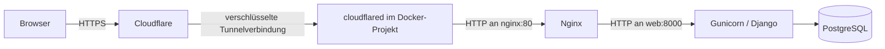

# Breakpoint-NG: Deployment Schritt für Schritt

Stand: 03.10.2026. Diese Anleitung gilt für die Produktion mit Docker,
Nginx und Cloudflare Tunnel. Die Entwicklung verwendet weiterhin
`docker-compose.yml` und den Django-Entwicklungsserver.

## Zum Einstieg: Was muss miteinander verbunden sein?

Alle Befehle in dieser Anleitung werden im Projektordner auf dem Server ausgeführt.
Unter Linux dafür ein Terminal öffnen; unter Windows **Git Bash** verwenden.
`DEINE-DOMAIN` oder `tennis.example` immer durch die eigene Vereinsdomain ersetzen.
In `.env` gehören nur die Werte, keine Markdown-Zeichen wie Backticks.



Ein **Container** ist ein getrennt laufender Dienst. **Nginx** nimmt Seitenaufrufe
an und liefert unter anderem das Design aus. **Django** bearbeitet Vereinsdaten
und Buchungen. **cloudflared** verbindet dieses Docker-Projekt mit Cloudflare.

**„Healthy“ bei Cloudflare bestätigt die Tunnelverbindung, nicht die Website.**
Die Verbindung zu Cloudflare steht, aber die Weiterleitung zum Webdienst kann
scheitern. Cloudflare dokumentiert diese
[Unterscheidung und die typischen 502-Ursachen](https://developers.cloudflare.com/cloudflare-one/networks/connectors/cloudflare-tunnel/troubleshoot-tunnels/common-errors/).

Bei einem aktuellen 502 zuerst [Abschnitt 11](#11-fehler-diagnostizieren) verwenden.
Für eine neue Installation die folgenden Schritte der Reihe nach ausführen.
Für den ersten Start genügen die Abschnitte **1 bis 7**. Bestehende Installationen
werden nach der Einrichtung mit Abschnitt **8** aktualisiert. Die Abschnitte
**9 und 10** behandeln Sicherung und Wiederherstellung; Abschnitt **13** ist für
Entwickler gedacht.

## 1. Voraussetzungen prüfen

Auf dem Server werden Git, Bash, gzip und Docker mit Linux-Containern sowie
eine aktuelle Docker-Compose-Version (v2 oder neuer) benötigt. Für den
Produktivbetrieb ist ein Linux-Server vorgesehen. Unter Windows dieselben
Skripte in Git Bash mit Docker Desktop im Linux-Modus ausführen.

```bash
git --version
bash --version
gzip --version
docker version
docker info --format '{{.OSType}}'
docker compose version
docker compose up --help
```

Erwartet: Docker-Client und -Server sind erreichbar, der Betriebssystemtyp
ist `linux`, und Compose unterstützt `--wait` und `--wait-timeout`.
Nur ein installiertes Compose-Programm ohne Docker-Daemon genügt nicht.
Der Server benötigt ausgehenden Zugriff auf Paket-/Image-Registries,
Cloudflare und den verwendeten SMTP-Server. Am Router sind keine eingehenden
Portfreigaben nötig; die Produktions-Compose-Datei veröffentlicht keine Hostports.
Eine ausgehende Firewall muss Cloudflare Tunnel auf Port **7844 über UDP und TCP**
zulassen. UDP wird für QUIC, TCP für HTTP/2 verwendet; siehe
[Cloudflare-Firewallanforderungen](https://developers.cloudflare.com/cloudflare-one/networks/connectors/cloudflare-tunnel/configure-tunnels/tunnel-with-firewall/).

## 2. Repository bereitstellen

Nur auf einem neuen Server:

```bash
git clone https://github.com/eschafellner/breakpoint-ng.git Breakpoint-ng
cd Breakpoint-ng
```

Bei einer bestehenden Installation im bisherigen Projektverzeichnis arbeiten.
Den vorhandenen Compose-Projektnamen beibehalten, damit dieselben Daten-Volumes
verwendet werden. Falls bisher `COMPOSE_PROJECT_NAME` in `.env` gesetzt war,
diesen Wert übernehmen. Der Projektname ist mit
`docker compose -f docker-compose.prod.yml config --format json` einsehbar;
diese Ausgabe enthält auch konfigurierte Zugangsdaten und gehört nicht in Logs.

Kein `docker compose down -v` und kein Volume-Pruning auf der Produktionsinstallation
ausführen: Diese Befehle können die gespeicherten Vereinsdaten entfernen.

## 3. Produktionskonfiguration anlegen

Nur wenn noch keine `.env` existiert:

```bash
cp .env.example .env
chmod 600 .env
```

Eine bestehende `.env` nicht überschreiben. Die folgenden Werte mit einem
Texteditor eintragen; Beispielwerte aus der Vorlage müssen ersetzt werden.

| Variable | Einzutragender Wert |
| --- | --- |
| `DJANGO_SECRET_KEY` | Eigener zufälliger Schlüssel; auf einem bestehenden System behalten |
| `DJANGO_SECRET_KEY_FALLBACKS` | Normalerweise leer; alte Schlüssel nur bei geplanter Rotation |
| `DJANGO_ALLOWED_HOSTS` | Vereinsdomain(s), durch Kommas getrennt, ohne `https://` |
| `CSRF_TRUSTED_ORIGINS` | Dieselben öffentlichen Domains mit `https://` |
| `DB_NAME`, `DB_USER`, `DB_PASSWORD` | PostgreSQL-Datenbank und Zugangsdaten |
| `EMAIL_HOST`, `EMAIL_PORT`, `EMAIL_USE_TLS` | SMTP-Server, typischerweise Port 587 mit TLS |
| `EMAIL_HOST_USER`, `EMAIL_HOST_PASSWORD` | SMTP-Anmeldung |
| `DEFAULT_FROM_EMAIL` | Zulässige Absenderadresse, bei Anzeigenamen in Anführungszeichen |
| `CLOUDFLARE_TUNNEL_TOKEN` | Token des vorgesehenen Cloudflare Tunnels |
| `PUBLIC_SITE_URL` | Für das Deployment erforderlich: eigene Adresse wie `https://tennis.example`, ohne Unterpfad |

Beispiel für die drei zusammengehörigen Domain-Werte:

```dotenv
DJANGO_ALLOWED_HOSTS=tennis.example
CSRF_TRUSTED_ORIGINS=https://tennis.example
PUBLIC_SITE_URL=https://tennis.example
```

Wer auch `www.tennis.example` nutzt, trägt beide Domains in Hostliste und
CSRF-Liste ein, jeweils durch Kommas getrennt. Die öffentliche Prüfung testet
die eine Adresse aus `PUBLIC_SITE_URL`; weitere Hostnamen anschließend im Browser prüfen.

Einen neuen Schlüssel kann man ohne lokale Python-Installation erzeugen:

```bash
docker run --rm python:3.12-slim python -c "import secrets; print(secrets.token_urlsafe(50))"
```

In Produktion setzt Compose `DB_HOST=db`, den PostgreSQL-Treiber und die
Redis-/Celery-Adressen selbst. Die `localhost`-Werte der Vorlage betreffen
lokale Entwicklung. Bei einem vorhandenen PostgreSQL-Volume verändert ein
neuer `DB_PASSWORD`-Wert nicht automatisch das Passwort im Datenbankserver;
eine Passwortänderung muss dort separat erfolgen.

`PUBLIC_SITE_URL`, Hostliste und CSRF-Origin müssen zusammenpassen. Das Skript
prüft das vor dem Stoppen der bisherigen Anwendung. Fehlt die öffentliche URL,
bricht es ab. So entsteht keine Erfolgsmeldung mit ungeprüfter Domain.

**Cloudflare Access** ist eine zusätzliche Anmeldung vor der Vereinswebsite.
Falls Access eingesetzt wird, die URL trotzdem eintragen und die ausdrückliche
Ausnahme in Abschnitt 5 verwenden; der öffentliche Test erfolgt dann im
angemeldeten Browser. Auch E-Mail-Links verwenden die eingetragene Vereinsadresse.

### Vor dem ersten Update auf den geprüften Code-Stand

Die neuen Migrationen ergänzen das Login-Zeitfenster und den Erinnerungszeitpunkt,
machen E-Mail-Adressen unabhängig von Groß-/Kleinschreibung eindeutig und
verschlüsseln bestehende SEPA-IBANs. `prepare` führt sie automatisch aus.
Der bestehende `DJANGO_SECRET_KEY` muss dabei erhalten bleiben. Die Sicherung
vor den Migrationen erfolgt durch `scripts/deploy.sh`.

Bei bestehenden Daten zuerst auf doppelte E-Mail-Adressen prüfen:

```bash
docker compose -f docker-compose.prod.yml exec -T web python manage.py shell -c 'from django.contrib.auth import get_user_model; from django.db.models import Count; from django.db.models.functions import Lower; print(list(get_user_model().objects.values(normalized_email=Lower("email")).annotate(total=Count("pk")).filter(total__gt=1)))'
```

Erwartet wird `[]`. Andernfalls die betroffenen Konten und ihre Mitgliedschaften,
Buchungen und Forderungen fachlich prüfen und bereinigen. Die Migration bricht
bei solchen Dubletten bewusst ab und löscht oder vereinigt keine Konten automatisch.
Die Ausgabe enthält personenbezogene Daten und gehört nicht in öffentliche Logs.

## 4. Cloudflare Tunnel auf Nginx einstellen

1. Im Cloudflare-Dashboard **Networking → Tunnels** öffnen. Je nach Dashboard
   findet sich die Liste unter **Networks → Connectors → Cloudflare Tunnels**.
2. Einen Tunnel für diese Installation erstellen oder den vorhandenen auswählen.
   Den Token dieses Tunnels in `.env` unter `CLOUDFLARE_TUNNEL_TOKEN` eintragen.
3. Die veröffentlichte Anwendung / den öffentlichen Hostnamen bearbeiten
   (oft „Published application routes“ oder „Public Hostnames“).
4. Die eigene Vereinsdomain und das folgende Ziel eintragen, speichern.

| Dashboard-Feld | Wert für dieses Projekt |
| --- | --- |
| Öffentlicher Hostname | `tennis.example` bzw. eigene Vereinsdomain |
| Pfad / Path | Leer lassen, damit alle Seiten und Dateien erreichbar sind |
| Service-Typ / Type | **HTTP** |
| URL, wenn Type separat auswählbar ist | **`nginx:80`** |
| Vollständige Service-URL | **`http://nginx:80`** |
| HTTP Host Header unter zusätzlichen Einstellungen | Leer lassen; so bleibt die Vereinsdomain erhalten |

- HTTPS für Besucher aktivieren und HTTP am Cloudflare-Rand auf HTTPS umleiten.
- Keine „Cache Everything“-Regel für dynamische Seiten oder `/media/` anwenden.
  Medien müssen `private, no-store` respektieren.
- HSTS erst für eine vollständig über HTTPS erreichbare Domain aktivieren.

**Warum HTTP, obwohl die Website HTTPS verwendet?** Besucher verbinden sich
verschlüsselt mit Cloudflare. Auch die Tunnelverbindung ist verschlüsselt.
Nginx nimmt innerhalb dieses Docker-Projekts HTTP auf Port 80 entgegen und hat
hier keinen HTTPS-Port. `https://nginx:80` ist deshalb das falsche Ziel.

**Warum nicht localhost?** Im Tunnel-Container bedeutet `localhost` bzw.
`127.0.0.1` „dieser Tunnel-Container“. Nginx läuft in einem anderen Container.
Docker findet ihn im gemeinsamen Projektnetzwerk über den Namen `nginx`.
Ebenso gehören hier keine Server-IP, öffentliche Vereinsdomain oder
`host.docker.internal` als Ziel hinein. `web:8000` würde Nginx und damit die
Auslieferung von CSS und Dateien umgehen.

Der Tunnel wird **durch dieses Compose-Projekt** gestartet. Die vom Dashboard
vorgeschlagenen Installationsbefehle (`cloudflared service install` oder ein
separates `docker run`) sind deshalb für diese Anleitung nicht zusätzlich
auszuführen. Ein außerhalb des Projekts gestarteter Connector kann den
Docker-Namen `nginx` normalerweise nicht erreichen.

Bei bestehenden Installationen in der Tunnelübersicht alle **Connectors / Replicas**
prüfen: Gibt es noch einen alten Windows-Dienst, ein NAS oder einen Testserver mit
demselben Tunnel-Token? Auch diese Instanzen können Anfragen erhalten. Jeder
beabsichtigte Connector muss sein Ziel erreichen; versehentliche alte Instanzen
nach Klärung ihrer Nutzung gezielt stoppen. Die vier Verbindungen einer einzelnen
Instanz sind normal und nicht vier separat installierte Connector-Prozesse.
Siehe [Cloudflare-Replikate](https://developers.cloudflare.com/cloudflare-one/networks/connectors/cloudflare-tunnel/configure-tunnels/tunnel-availability/deploy-replicas/).

Beim Anlegen des öffentlichen Hostnamens erstellt Cloudflare normalerweise den
zugehörigen DNS-Eintrag. In der DNS-Übersicht prüfen, dass die Domain auf den
vorgesehenen Tunnel zeigt; bestehende widersprüchliche Einträge zuerst zuordnen.
Token, Tunnel und öffentliche Domain müssen zur selben Installation gehören.
Die Compose-Datei verändert die Dashboard-Route und DNS-Einträge nicht.
Grundlage: [Cloudflare-Tunneleinrichtung](https://developers.cloudflare.com/tunnel/get-started/).
Eine bestehende Installation ist während der Umstellung kurzzeitig unterbrochen.

## 5. Deployment ausführen

```bash
docker compose -f docker-compose.prod.yml config --quiet
bash scripts/deploy.sh
```

Der Ablauf ist bei Erstinstallation und Updates derselbe:

1. Ein Deployment-Lock verhindert gleichzeitige Skriptläufe.
2. Konfiguration prüfen, Anwendung bauen, öffentliche Domain/Hosts/CSRF prüfen,
   Nginx-/Tunnel-Images herunterladen.
   Fehler in dieser Phase stoppen die bisher laufende Anwendung nicht.
3. PostgreSQL und Redis starten und auf Bereitschaft warten.
4. Tunnel, Nginx, Web und Celery für das Wartungsfenster stoppen.
5. Datenbank und das Docker-Medien-Volume sichern; fehlerhafte Backups brechen ab.
   Beim ersten Start ist dies eine Sicherung des noch leeren Systems.
6. Den einmaligen Dienst `prepare` neu erstellen: Migrationen, `collectstatic`,
   Prüfung des versionierten Stylesheets.
7. Web und Nginx neu erstellen und ihre Healthchecks abwarten.
8. Nginx-Konfiguration sowie echte HTTP-Auslieferung von Vereins-/Admin-CSS,
   Startseite und vorhandenen öffentlichen Bildern prüfen.
9. Celery Worker und Beat starten und ihre Healthchecks abwarten.
10. Tunnel starten und auf die Cloudflare-Verbindung warten (`/ready`).
11. Mit dem kurzlebigen Hilfsdienst `tunnel_probe` aus dem Netzwerk des
    Tunnel-Containers Nginx, Anwendung und CSS prüfen.
12. Über `PUBLIC_SITE_URL` bis zu 60 Sekunden auf drei aufeinanderfolgende
    erfolgreiche Bereitschaftsantworten warten; anschließend die Startseite,
    aktuellen CSS-Dateien und Medienzugriffe über HTTPS prüfen. Die Anfragen
    besitzen jeweils eine neue Prüfkennung und Cache-Control-Header.

Bei einem Fehler nach Beginn des Wartungsfensters wird der Tunnel gestoppt.
Das Skript meldet Erfolg erst nach den vorgesehenen Prüfungen.
Bei einem öffentlichen Fehler auch das Dashboard-Ziel prüfen; der
interne Test allein kann dessen korrekten Eintrag nicht nachweisen.
Backups werden nicht automatisch gelöscht; Speicherplatz und Aufbewahrung
müssen im Betrieb verwaltet werden.

Bei einer absichtlich durch **Cloudflare Access** geschützten Website:

```bash
bash scripts/deploy.sh --skip-public-check
```

Dann steht ausdrücklich **„öffentliche Website NICHT geprüft“** in der Ausgabe.
Die lokale Prüfung, Tunnelverbindung und der Test im Tunnel-Netzwerk laufen
weiterhin. Anschließend im angemeldeten Browser Startseite, `/healthz/`, Design
und Anmeldung prüfen. Diese Ausnahme behebt keinen 502; sie ist kein Ersatz für
die Prüfung der öffentlichen Website. `PUBLIC_SITE_URL` bleibt erforderlich.

Ein direktes `docker compose up -d --build` besitzt zwar Startabhängigkeiten,
ersetzt aber weder die Backup-Schritte noch den vollständigen Prüfablauf des Skripts.

## 6. Administrator anlegen

Nur beim ersten Deployment, wenn noch kein Administrator existiert:

```bash
docker compose -f docker-compose.prod.yml exec web python manage.py createsuperuser
```

Eigene E-Mail-Adresse und ein eigenes Passwort wählen. Danach unter
`https://DEINE-DOMAIN/admin/` anmelden und Vereinsname, Kontaktdaten,
Mitgliedschaftsarten, Platzregeln und Bankverbindung pflegen.

`seed_data` ist für Entwicklungs-/Demosysteme vorgesehen. Auf dem öffentlichen
Produktionssystem keine Demokonten mit bekannten Passwörtern anlegen.

## 7. Technischen und fachlichen Funktionstest durchführen

```bash
docker compose -f docker-compose.prod.yml ps -a
docker compose -f docker-compose.prod.yml exec -T nginx nginx -t
docker compose -f docker-compose.prod.yml exec -T web python scripts/check_deployment.py
docker compose -f docker-compose.prod.yml exec -T web python scripts/check_tunnel.py
docker compose -f docker-compose.prod.yml run --rm --no-deps -T tunnel_probe
docker compose -f docker-compose.prod.yml exec -T web python scripts/check_deployment.py --public
docker compose -f docker-compose.prod.yml exec -T web python manage.py check --deploy
```

`prepare` soll mit **Exit-Code 0** beendet sein. DB, Redis, Web, Nginx und
Celery sollen laufen; die vorhandenen Healthchecks sollen `healthy` zeigen.
Der Tunnel besitzt eine separate Verbindungsprüfung, keinen eingebauten
Compose-Healthcheck im minimalen Cloudflare-Image.

Der HTTP-Test erwartet CSS mit **HTTP 200, `text/css` und dem Inhalt des
aktuellen Images**. Die Startseite muss das versionierte Stylesheet referenzieren.
Ohne hochgeladene öffentliche Bilder meldet der Bildtest einen Hinweis.

Im Browser zusätzlich prüfen:

1. Startseite und Admin besitzen Styles, auch nach einem Neuladen.
2. Administrator kann sich anmelden und speichern; keine CSRF-Fehler.
3. Ein veröffentlichtes öffentliches Newsbild wird ausgeliefert.
4. Ein internes Newsbild ist für ein Mitglied erreichbar, aber über dieselbe
   direkte Bild-URL in einem privaten Browserfenster nicht erreichbar.
5. SMTP funktioniert, etwa über einen selbst ausgelösten Passwort-Reset.
6. Testweise eine Buchung durchführen und die erwarteten Berechtigungen prüfen.

Aktuell meldet `check --deploy` bei den vorhandenen Produktionseinstellungen
`security.W004` (HSTS) und `security.W008` (HTTPS-Umleitung). Diese sind noch
nicht durch lokale Tests erledigt. Die Cloudflare-Umleitung und die HSTS-Header
der öffentlichen Domain separat prüfen. Django-HSTS bleibt zunächst deaktiviert,
und interne HTTP-Healthchecks dürfen nicht unbeabsichtigt auf HTTPS umgeleitet werden.
Prüfstand: [DEPLOYMENT_PRUEFUNG.md](DEPLOYMENT_PRUEFUNG.md).

## 8. Laufende Updates einspielen

```bash
bash update.sh
```

Das Skript verweigert lokale Änderungen, holt Code mit `git pull --ff-only`
und verwendet anschließend denselben Deployment-Ablauf mit Backup und Tests.
Bei Cloudflare Access entsprechend `bash update.sh --skip-public-check` verwenden
und anschließend die öffentliche Website im angemeldeten Browser prüfen.
Ein Wartungsfenster ist einzuplanen. Vor einem eigenen manuellen Checkout die
Änderungen prüfen; für bereits ausgecheckten Code `bash scripts/deploy.sh` verwenden.

Ein `docker compose restart` kopiert keinen neuen Quellcode ins Image.
Migrationen werden bei Fehlern nicht automatisch zurückgesetzt.

## 9. Backups erstellen und außerhalb des Servers sichern

```bash
bash scripts/backup.sh
```

Dies erzeugt zwei zusammengehörige Dateien mit gleichem Zeitstempel:

- `backups/db_backup_<zeitstempel>.sql.gz`: PostgreSQL-Dump mit Container-Zugangsdaten.
- `backups/media_backup_<zeitstempel>.tar.gz`: Inhalt von `media_prod_volume`.

Das Skript benötigt eine laufende DB und das gebaute Anwendungsimage mit
`scripts/media_archive.py`. Ein vorhandener Webcontainer muss dabei nicht laufen.
Bei der erstmaligen Übernahme dieser Skripte zuvor
`docker compose -f docker-compose.prod.yml build prepare` ausführen.

Während eines normalen Online-Backups können Uploads geändert werden. Für ein
zusammenpassendes DB-/Medien-Backup die schreibenden Anwendungsdienste zuerst
stoppen; das Deployment-Skript macht dies automatisch.
Ein täglicher Backup-Termin muss auf dem Server separat eingerichtet werden.
Diese Anleitung installiert keinen Cronjob.

Beide Dateien auf NAS oder externen Speicher kopieren. Die `.env` separat
geschützt sichern; insbesondere den ursprünglichen `DJANGO_SECRET_KEY`
für die Wiederherstellung behalten. Backups und `.env` nicht zu GitHub hochladen.
Verschlüsselte SEPA-Daten sind ohne den passenden Schlüssel nicht lesbar.
Der DB-/Medien-Dump enthält die `.env` und ihre Schlüssel nicht.
Aufbewahrung, verfügbaren Speicherplatz und regelmäßige Restore-Tests festlegen.

### Geplante Rotation des SEPA-Schlüssels

1. Anwendungsdienste stoppen und DB-/Medien-Backup sowie bisherige `.env` sichern.
2. In `.env` einen neuen `DJANGO_SECRET_KEY` setzen und den bisherigen Schlüssel
   in `DJANGO_SECRET_KEY_FALLBACKS` eintragen. Bereits vorhandene, benötigte
   Fallback-Schlüssel beibehalten.
3. `bash scripts/deploy.sh` ausführen. Die Anwendung kann bestehende Daten mit
   dem Fallback lesen und schreibt neue Daten mit dem neuen Schlüssel.
4. Bestehende Datensätze neu verschlüsseln:

   ```bash
   docker compose -f docker-compose.prod.yml exec -T web python manage.py rotate_sepa_keys
   ```

5. Zugriff auf die SEPA-Daten prüfen und ein neues Backup erstellen. Erst dann
   den alten Fallback aus der aktuellen `.env` entfernen und die Anwendungsdienste
   mit `bash scripts/deploy.sh` neu erstellen.

Alte Backups brauchen weiterhin den damaligen Schlüssel. Diesen bis zum Ende
ihrer Aufbewahrung geschützt behalten. Ein bloßer Container-Restart lädt
geänderte Compose-Umgebungsvariablen nicht neu.

## 10. Backup wiederherstellen

Die Wiederherstellung verändert Daten. Sie sollte zunächst auf einem getrennten,
leeren System mit den zum Backup passenden Anwendungsversionen geprüft werden.

### Wiederherstellung auf einem neuen System

1. Repository bereitstellen, die gesicherte `.env` übernehmen und das zum Backup
   passende Git-Release auschecken. Die aktuellen Restore-Hilfsskripte benötigen
   ein Image, das `scripts/media_archive.py` enthält.
2. Image bauen und nur DB/Redis starten:

   ```bash
   docker compose -f docker-compose.prod.yml build prepare
   docker compose -f docker-compose.prod.yml up -d --wait --wait-timeout 120 db redis
   ```

3. Die beiden zusammengehörigen Backup-Dateien auf den Server kopieren.
4. Restore ausführen:

   ```bash
   bash scripts/restore.sh backups/db_backup_ZEITSTEMPEL.sql.gz backups/media_backup_ZEITSTEMPEL.tar.gz
   ```

5. Erst nach erfolgreichem Restore `bash scripts/deploy.sh` ausführen.
6. Anmeldung, Mitglieder, Buchungen und Bilder prüfen; danach den Tunnel
   auf diesen Server umstellen. Eine Testumgebung darf nicht versehentlich
   parallel über den Produktionstunnel veröffentlichen.

### Wiederherstellung auf einem bestehenden System

Zuerst den aktuellen Zustand sichern und anschließend alle Anwendungsdienste stoppen:

```bash
docker compose -f docker-compose.prod.yml stop cloudflared nginx celery_beat celery_worker web
bash scripts/backup.sh
bash scripts/restore.sh backups/db_backup_ZEITSTEMPEL.sql.gz backups/media_backup_ZEITSTEMPEL.tar.gz
bash scripts/deploy.sh
```

Das Restore-Skript verweigert die Arbeit, solange Anwendungsdienste oder
`prepare` laufen, und verwendet denselben Lock wie das Deployment.
Es prüft beide Archive vor dem SQL-Restore, verwendet
`ON_ERROR_STOP=1` und eine SQL-Transaktion und schreibt Medien ins Docker-Volume.
Medienpfade, Links und Spezialdateien werden vor dem Entpacken geprüft.

Die SQL-Sicherung enthält `DROP ... IF EXISTS` für gesicherte Objekte.
Zusätzliche Tabellen/Constraints aus einer neueren Version können einen Restore
in ein bestehendes Schema verhindern; dann ein leeres, getrenntes Ziel verwenden.
Vorhandene Medien werden überschrieben, zusätzliche Dateien jedoch nicht gelöscht.
SQL und Medien bilden keine gemeinsame Transaktion: Bei einem Medienfehler nach
erfolgreichem SQL-Restore bleiben die Anwendungsdienste gestoppt und der Fehler
muss vor dem Neustart behoben werden.

## 11. Fehler diagnostizieren

### „Healthy“, aber die Website zeigt 502: in dieser Reihenfolge prüfen

**1. Das Ziel im Dashboard kontrollieren.** Für diese Anleitung muss der
öffentliche Hostname auf **HTTP → `nginx:80`** zeigen. Ein Token richtet
diese Weiterleitung nicht automatisch ein. Keine zusätzlichen Connector-Prozesse
außerhalb des Compose-Projekts starten; vorhandene alte Instanzen ebenfalls prüfen.

**2. Die Dienste auf dem Server ansehen.**

```bash
docker compose -f docker-compose.prod.yml ps -a
```

Web, Nginx, DB und Redis müssen laufen und `healthy` anzeigen. `prepare`
mit `Exited (0)` ist richtig: Dieser Dienst beendet sich nach seiner Arbeit.
`cloudflared` mit `Up` bestätigt nur einen laufenden Prozess.

**3. Anwendung und tatsächlichen Netzwerkweg getrennt testen.**

```bash
# Anwendung über Nginx, aus dem Webcontainer:
docker compose -f docker-compose.prod.yml exec -T web python scripts/check_deployment.py

# Verbindung zu Cloudflare:
docker compose -f docker-compose.prod.yml exec -T web python scripts/check_tunnel.py

# Nginx und Anwendung, aus demselben Netzwerk wie der Tunnel:
docker compose -f docker-compose.prod.yml run --rm --no-deps -T tunnel_probe

# Vollständiger Weg über die Vereinsdomain:
docker compose -f docker-compose.prod.yml exec -T web python scripts/check_deployment.py --public
```

Der dritte Befehl benötigt einen laufenden Compose-Tunnel und das neue gebaute
Anwendungsimage. Der Hilfscontainer wird danach automatisch entfernt. Er verwendet
das [Netzwerk des Tunnel-Containers](https://docs.docker.com/reference/compose-file/services/#network_mode);
ein zusätzlicher Port am Server ist dafür nicht nötig. Das minimale
Cloudflare-Image besitzt keine Shell und kein `curl`, daher sind entsprechende
`docker exec cloudflared curl ...`-Anleitungen für dieses Projekt ungeeignet.

- Erster Test fehlgeschlagen: Problem bei Anwendung, Nginx, Datenbank oder Dateien.
- Erster Test erfolgreich, dritter fehlgeschlagen: Netzwerkweg zwischen Tunnel und Nginx prüfen.
- Erste drei Tests erfolgreich, öffentlicher Test fehlgeschlagen: Dashboard-Route,
  Domain/DNS, andere Connector-Instanzen und Access-/WAF-/Cache-Regeln prüfen.
- Öffentlicher Test zeigt eine Umleitung zur Access-Anmeldung: Im angemeldeten
  Browser prüfen; die ausdrückliche Access-Ausnahme ist in Abschnitt 5 beschrieben.

**4. Die Fehlermeldung in den Logs lesen.** Nach einem fehlgeschlagenen Deployment
stoppt das Skript den lokalen Tunnel. Die bisherigen Fehlermeldungen bleiben
über diesen Befehl lesbar:

```bash
docker compose -f docker-compose.prod.yml logs --tail=100 cloudflared nginx web db
```

| Beobachtung / Meldung | Bedeutung und nächster Prüfschritt |
| --- | --- |
| Cloudflare 502, `Unable to reach the origin service` | Tunnel verbunden, internes Ziel nicht erreichbar; Service-URL und Tunnel-Logs prüfen |
| `dial tcp ... connection refused` | Am Zielport antwortet kein Dienst; `nginx:80`, Containerstatus und unerwartetes `localhost` prüfen |
| `lookup nginx ... no such host` | Connector kennt das Docker-Netzwerk nicht; außerhalb des Projekts laufende oder alte Connector-Instanz prüfen |
| TLS-/Handshake-Fehler beim Origin | Wahrscheinlich HTTPS für den internen HTTP-Port gewählt; Type **HTTP**, URL `nginx:80` verwenden |
| `i/o timeout` / `context deadline exceeded` | Ziel antwortet nicht rechtzeitig; Netzwerk, Ressourcen und Web-/DB-Logs prüfen |
| Interner Test liefert 502, Nginx-Log nennt `upstream` | Nginx erreicht Gunicorn nicht; Webstatus und Weblogs prüfen |
| `/healthz/` liefert 503 | Anwendung erreicht PostgreSQL nicht; DB-Status und Zugangsdaten prüfen |
| HTTP 400 / `DisallowedHost` | Angefragte Domain fehlt in `DJANGO_ALLOWED_HOSTS` oder Hostheader wurde im Dashboard überschrieben |
| HTTP 403 oder Access-Anmeldung | Access/WAF blockiert die Anfrage; Zugangsregeln bzw. angemeldeten Browser prüfen |
| Cloudflare 1033 | Keine nutzbare Tunnelverbindung; nach einem Skriptabbruch bis zur Fehlerkorrektur möglich |
| CSS antwortet mit `text/html` | Tunnelziel, `prepare`-Exit-Code und Static-Volume prüfen |
| Nur öffentliche URL fehlerhaft | Cloudflare-Hostheader, Cache/Access und `PUBLIC_SITE_URL` prüfen |
| Migration oder Backup fehlgeschlagen | Dienste gestoppt lassen, Logs und freien Speicher prüfen |
| Nginx liefert 502 | Web-Healthcheck, Gunicorn-Logs und Nginx-Konfiguration prüfen |
| CSRF-Fehler | Öffentliche Domain, HTTPS-Origin und weitergeleitetes Protokoll prüfen |
| Celery startet nicht | Redis, Worker-Healthcheck und Celery-Logs prüfen |
| Tunnel verbindet nicht | Token, ausgehende Verbindung und Tunnel-Logs prüfen |
| Deployment-Lock vorhanden | Zuerst sicherstellen, dass kein Deployment läuft; nur einen verwaisten Lock entfernen |

Wenn weiterhin Fehler auftreten, zusätzlich Vorbereitung und Hintergrunddienste ansehen:

```bash
docker compose -f docker-compose.prod.yml logs --tail=100 prepare celery_worker celery_beat
```

Bei **sporadischen** 502 alle Connector-Instanzen prüfen. Ein lokaler Test
untersucht nur den Connector dieses Docker-Projekts. Auch mehrere erfolgreiche
öffentliche Anfragen beweisen nicht, dass jede andere Instanz funktioniert.
Ein gestoppter lokaler Tunnel stoppt keine auf anderen Rechnern laufenden Instanzen.

Wenn `web` außerhalb des Deployment-Skripts neu erstellt wurde, kann Nginx noch
die frühere Container-IP verwenden. Das reguläre Deployment erstellt beide
Dienste neu. Nur Nginx oder nur den Webcontainer neu zu erstellen ersetzt diesen
Abgleich nicht.

Ein erfolgreicher Lauf prüft den Zustand **zu diesem Zeitpunkt**.
Compose-Startabhängigkeiten steuern die Startreihenfolge; sie überwachen den
laufenden Dienst nicht dauerhaft. `restart: always` startet einen beendeten
Prozess neu, einen lediglich `unhealthy` gewordenen Container nicht automatisch.
Siehe [Compose-Startabhängigkeiten](https://docs.docker.com/compose/how-tos/startup-order/).
Bei späteren Ausfällen daher erneut Status und Logs prüfen.

Nach der Fehlerkorrektur `bash scripts/deploy.sh` erneut ausführen.
Bei einem Prozessabbruch mit SIGKILL kann ein leerer Lock-Ordner verbleiben.
Nach Prüfung, dass kein Deployment mehr läuft, im Projektverzeichnis
`rmdir .deployment-lock` verwenden. Keine Produktions-Volumes löschen.

## 12. Zuständigkeiten der Komponenten

**Browser → Cloudflare Tunnel → Nginx → Gunicorn/Django**

- `prepare` schreibt gesammelte Assets in `static_prod_volume`.
- Web/Nginx lesen statische Dateien nur; Hash-URLs erhalten ein Jahr Cache-Zeit,
  ursprüngliche Dateinamen 60 Sekunden. CSS/JavaScript werden mit Gzip komprimiert.
- Web/Celery schreiben Uploads; Nginx liest `media_prod_volume` nur.
- Jede `/media/`-Anfrage wird durch Django autorisiert, anschließend liefert
  Nginx per `X-Accel-Redirect` über einen internen Pfad aus.
- Vereinslogos sind öffentlich, Newsbilder folgen dem Artikelzugriff,
  Profilbilder sind für Besitzer/Staff erreichbar; unbekannte Dateien bleiben gesperrt.
- Der aktuelle CSS-Stand benötigt keinen Tailwind-/Node-Build.
- **WhiteNoise wird nicht eingesetzt.**
- Celery Beat läuft einmal mit persistentem Scheduler-Stand:
  Mitgliedschaftsprüfung täglich 00:05 Uhr, Buchungserinnerungen stündlich,
  Ablauf unbestätigter Turnierpartner ebenfalls stündlich,
  in der eingestellten Zeitzone `Europe/Vienna`.

## 13. Lokal verifizierbare Regressionstests

```bash
python -m pip install -e '.[dev]'
python -m pytest
NGINX_BINARY=/usr/sbin/nginx pytest tests/test_deployment.py tests/test_deployment_operations.py tests/test_tunnel_deployment.py
```

Unter PowerShell zuerst `$env:NGINX_BINARY = 'C:/Pfad/nginx.exe'` setzen.
Die echten Nginx-HTTP-Tests benötigen Nginx; alle Dateien und Ports sind temporär.
Ohne Nginx werden diese Tests übersprungen. Die Skripttests verwenden
simulierte Docker-Aufrufe und berühren keine Produktionsdaten.
Ein echter PostgreSQL-Restore und ein vollständiger Compose-Start müssen
zusätzlich auf einem Docker-System geprüft werden.

Die sieben Tests mit parallelen Datenbanktransaktionen benötigen PostgreSQL;
unter SQLite werden sie ausdrücklich übersprungen. Mit einer getrennten lokalen
Testinstanz (kein Produktionsserver) lässt sich die vollständige Suite so starten:

```bash
DB_ENGINE=django.db.backends.postgresql DB_NAME=breakpoint_tests DB_USER=postgres DB_PASSWORD=TESTPASSWORT DB_HOST=127.0.0.1 DB_PORT=5432 python -m pytest
```

Der Testbenutzer muss Testdatenbanken anlegen und löschen dürfen. Der Testlauf
verwendet `test_breakpoint_tests`. In PowerShell die Variablen vorher mit
`$env:DB_ENGINE = 'django.db.backends.postgresql'` usw. setzen.
Die JavaScript-Prüfung der tatsächlichen Preisvorschau benötigt Node.js.
Der GitHub-Workflow prüft SQLite und PostgreSQL mit installiertem Nginx.
Ergebnisse und fachliche Grenzen: [CODE_PRUEFUNG.md](CODE_PRUEFUNG.md).

Technische Referenzen:
[Compose-Startabhängigkeiten](https://docs.docker.com/compose/how-tos/startup-order/),
[Docker-Volumes](https://docs.docker.com/engine/storage/volumes/),
[PostgreSQL-Dumps](https://www.postgresql.org/docs/16/app-pgdump.html),
[Cloudflare-Verbindungsprüfung](https://developers.cloudflare.com/tunnel/guides/kubernetes/).
